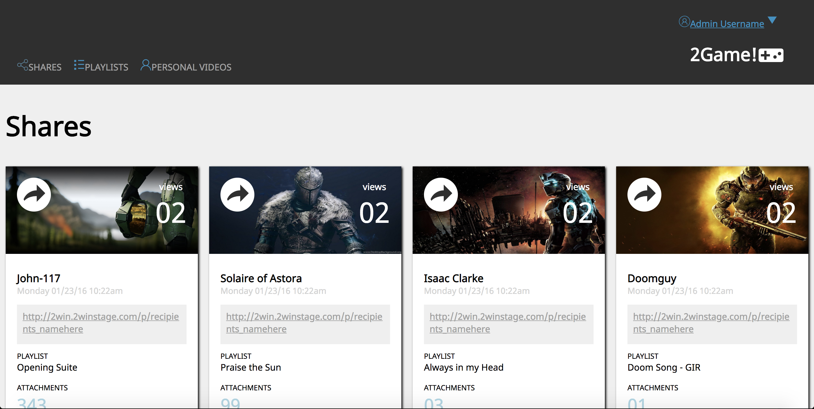
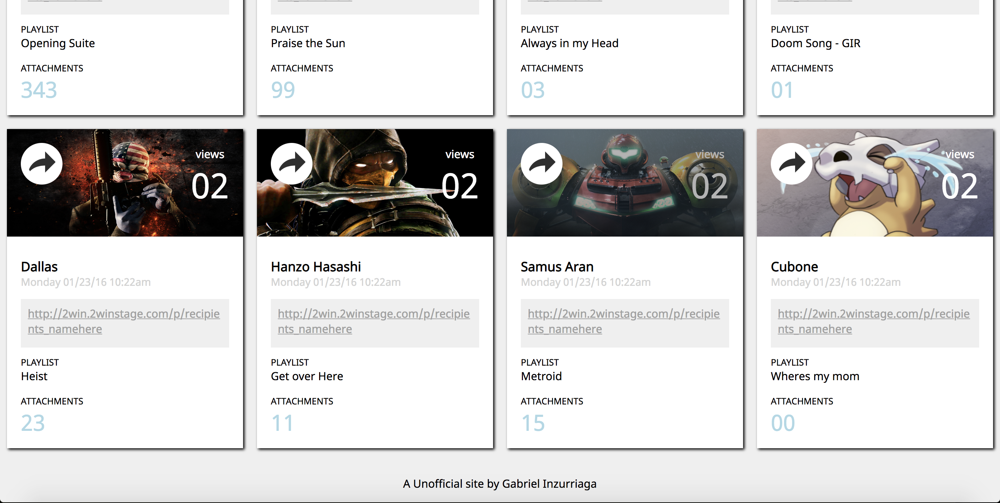
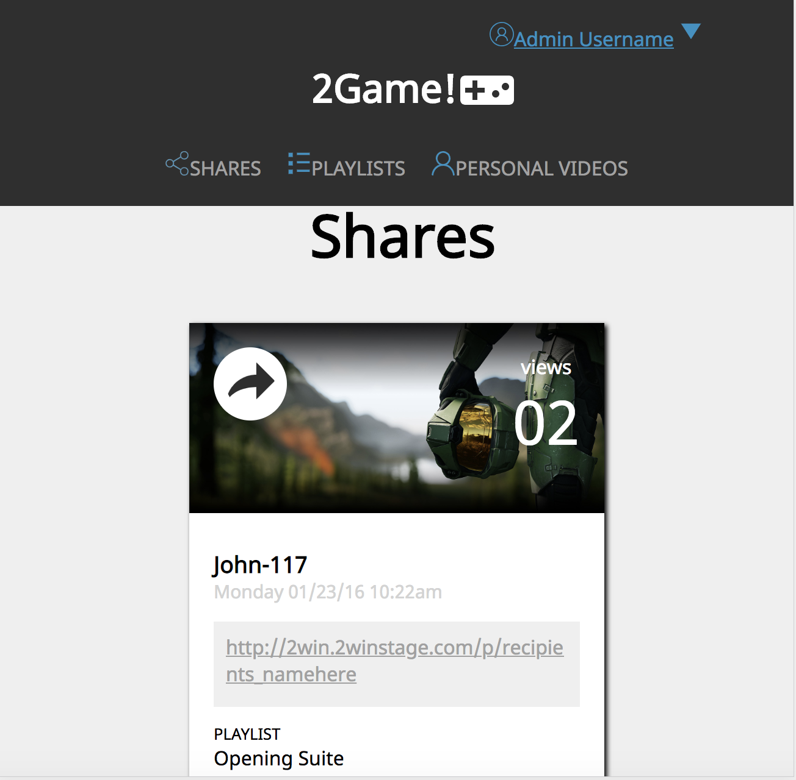

# Static Comp Challenge 1

## Original photo

## Screenshot of my site

#### top of site

#### bottom of site

#### site when it reaches 650px width

#### site seen in mobile/ when it reaches 420px width

## Synopsis
This project is to duplicate a image into a working website without the use of grid  and create are own svg and images to add to the site. 

## Built With
* CSS
* HTML

## Original Assignment - Turing MOD1

Staitc Comp Challenge 1

#### Specifications

#### Base Requirements 
* Create the Html and CSS files calling them index.html and style.css.
* Create or find svg and images to use for the site. 
* The site must be responsive down to a mobile phone (320px width).

#### Additional Requirements
* Site must work across firefox, safari, chrome, and EI.
* Must use normalize instead of reset file in CSS.

#### Submission Details
* create and repo on Github.
* include a README.md that provides a overview of project.
* Push final work to Github

